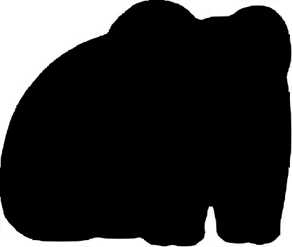
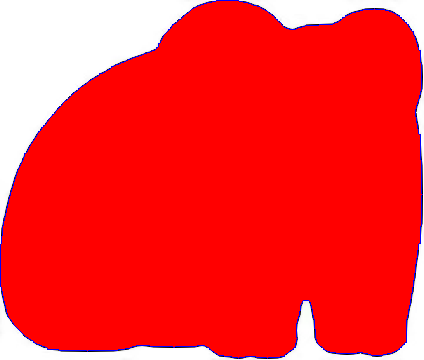

# Example

## Original image:


## Mask:



## Output: (converted to png)



## Points:

```
0,244,2,234,3,224,5,214,7,204,10,194,13,184,16,174,20,164,24,154,30,145,36,136,41,127,48,119,55,111,62,103,70,96,78,89,86,83,94,77,103,72,111,66,121,62,131,58,141,55,151,51,158,43,164,34,171,26,179,19,187,13,195,7,205,3,215,1,225,0,235,0,245,2,255,5,265,10,274,16,281,24,290,29,300,27,310,25,320,24,330,24,340,20,348,14,358,11,368,9,378,9,388,10,397,15,405,22,411,30,416,40,419,50,420,60,421,70,421,80,421,90,418,100,415,110,416,120,418,130,420,140,420,150,421,160,421,170,421,180,421,190,421,200,421,210,421,220,420,230,420,240,417,250,416,260,415,270,413,280,412,290,410,300,408,310,406,320,406,330,406,340,399,348,390,353,380,355,370,354,360,352,350,353,340,353,330,352,321,346,315,338,314,328,313,318,311,308,305,300,300,309,297,319,296,329,296,339,293,349,284,355,274,357,264,357,254,356,244,357,234,357,224,356,214,352,206,346,196,346,186,346,176,346,166,346,156,346,146,345,136,345,126,348,116,350,106,350,96,350,86,350,76,350,66,350,56,349,46,347,36,343,27,337,19,330,12,322,7,313,4,303,2,293,0,283,0,273,0,263,0,253,
```

Command used:
```bash
img2map -i frog_mask.png -c "#000000" -o out -s 10 > points.txt
```